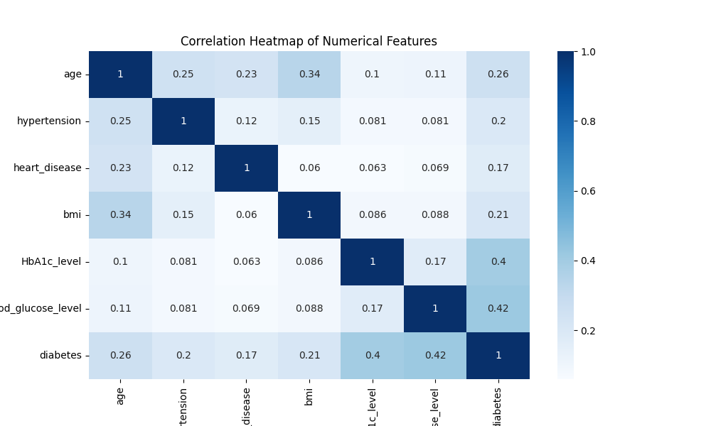
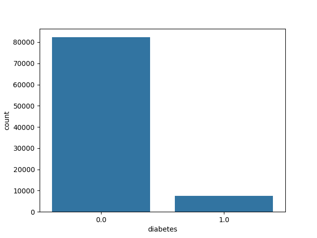
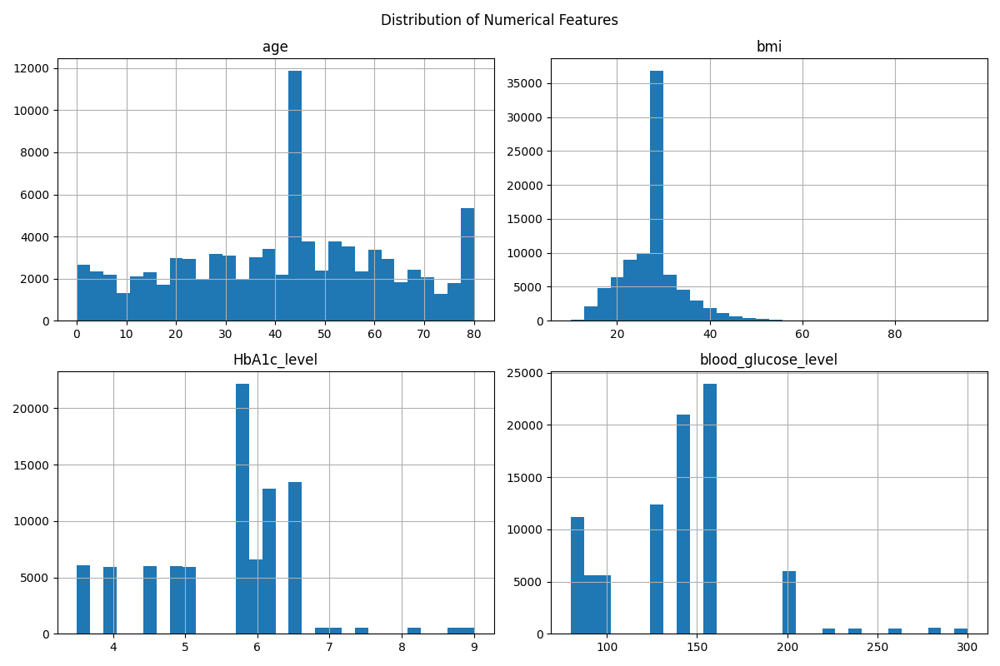
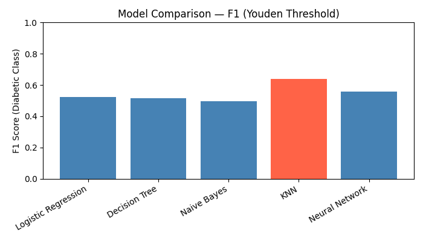
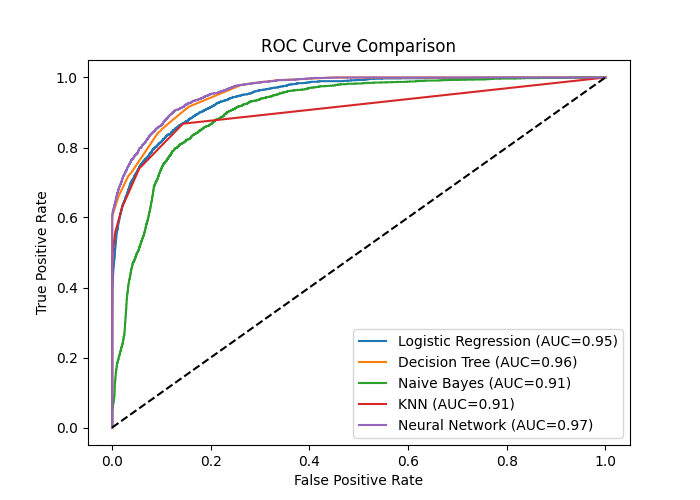
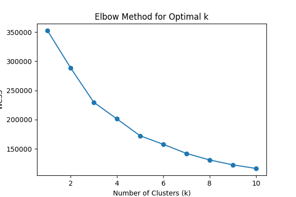
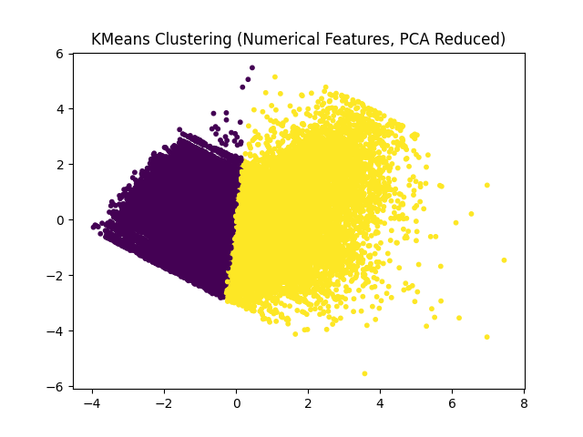

# Real World Diabetes Prediction (Machine Learning + Flask)

A production-style machine learning workflow for diabetes risk prediction, packaged with a Flask web interface. The project includes data preprocessing, model training and selection, evaluation, and a UI that serves predictions from saved artifacts.

## Overview

This project trains multiple supervised classifiers on a diabetes dataset, selects the best model based on F1 score for the diabetic class using a Youden threshold, and exposes a web form where users can input clinical parameters to receive a risk prediction. The training pipeline also generates evaluation visuals and persists all artifacts needed for inference.

## Web Interface

The Flask app provides a clean, form-based UI and shows risk percentage, risk level, and key indicators. The interface is implemented in [templates/index.html](templates/index.html) and styled in [static/style.css](static/style.css).

## Visuals

Below are the evaluation and analysis plots generated during training:









## Models Used

Training compares the following supervised models:

- Logistic Regression
- Decision Tree
- Gaussian Naive Bayes
- K-Nearest Neighbors
- Neural Network (MLP)

For each model, probabilities are evaluated with ROC curves and a Youden-optimal threshold. The best model is selected by F1 score on the diabetic class and saved to artifacts for inference.

Unsupervised exploration is included with KMeans clustering on numerical features (PCA-reduced) to visualize structure.

## Testing and Evaluation

The training script evaluates models using:

- Accuracy, Precision, Recall, F1
- Confusion Matrix
- ROC Curve and AUC

The diagnostic script [test_model.py](test_model.py) loads the saved model and scaler and runs three test profiles (high, medium, low risk) to validate inference behavior.

## Project Structure

```
real-world-diabetes-prediction-ml-flask/
├── artifacts/
│   ├── feature_order.pkl
│   ├── label_encoders.pkl
│   ├── model.pkl
│   ├── model_metadata.pkl
│   └── scaler.pkl
├── reports/
│   └── figures/
│       ├── correlation_heatmap.png
│       ├── diabetes_distribution.png
│       ├── feature_distributions.png
│       ├── model_comparison.png
│       ├── roc_curves.png
│       ├── elbow_method.png
│       └── kmeans_clustering.png
├── static/
│   └── style.css
├── templates/
│   └── index.html
├── app.py
├── diabetes_dataset.csv
├── test_model.py
├── train_model.py
└── README.md
```

## How to Run

1) Create and activate a virtual environment (optional but recommended).
2) Install dependencies.
3) Train the model to generate artifacts.
4) Run the Flask app.

```bash
pip install -r requirements.txt
python train_model.py
python app.py
```

Then open http://localhost:5000 in your browser.

## Inference Details

The Flask app loads these artifacts from [artifacts/](artifacts/):

- `model.pkl` (best model)
- `scaler.pkl` (StandardScaler)
- `feature_order.pkl` (feature alignment)
- `label_encoders.pkl` (gender and smoking history encoders)
- `model_metadata.pkl` (model name, accuracy, F1, threshold)

Prediction uses the Youden-optimal threshold saved during training rather than the default 0.5.

## Data and Features

Inputs used for prediction:

- gender
- age
- hypertension
- heart_disease
- smoking_history
- bmi
- HbA1c_level
- blood_glucose_level

## Notes and Limitations

- The dataset is imbalanced; evaluation prioritizes recall and F1 for the diabetic class.
- This project is for educational use and is not a clinical tool.

## License

Educational and academic use only.